<h1 align="center" >
  
  TGL
</h1>

<p align="center">TGL The Greatest App for Lottery</p>


<p align="center">
 <a href="#-sobre">Sobre</a> •
 <a href="#-layout">Layout</a> • 
 <a href="#-executando-o-happy">Como executar</a> • 
 <a href="#-tecnologias">Tecnologias</a> • 
 <a href="#-autor">Autor</a> 
</p>

---

## 💡 Sobre

Essa aplicação permite que você faça apostas de diversos tipos.

Essa aplicação foi desenvolvida como teste de formação no LabyLubyJS da [LubySoftware](https://www.luby.com.br/).

---

## 🎨 Layout


### Web

<p align="center">
                                SignIn
  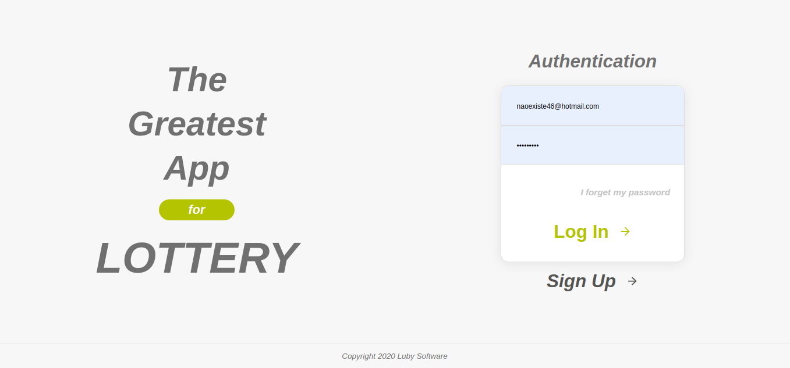
                                SignUp
  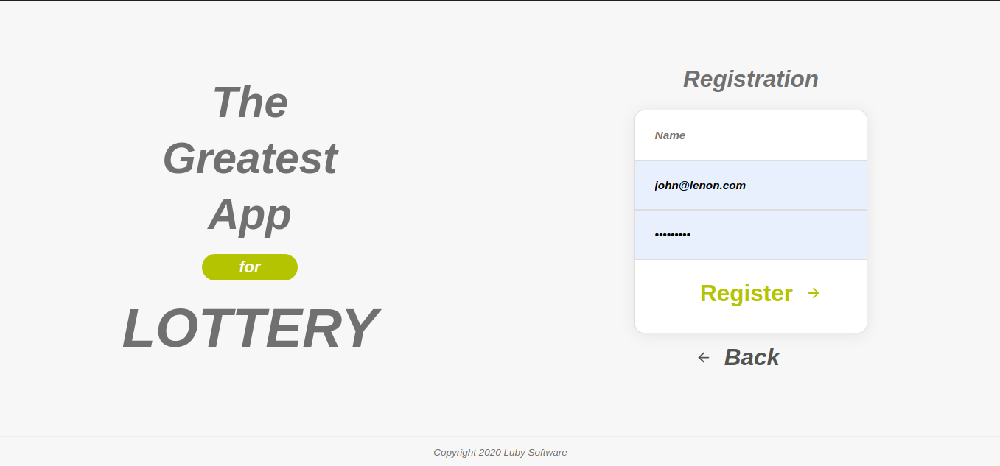
                                ResetPassword
  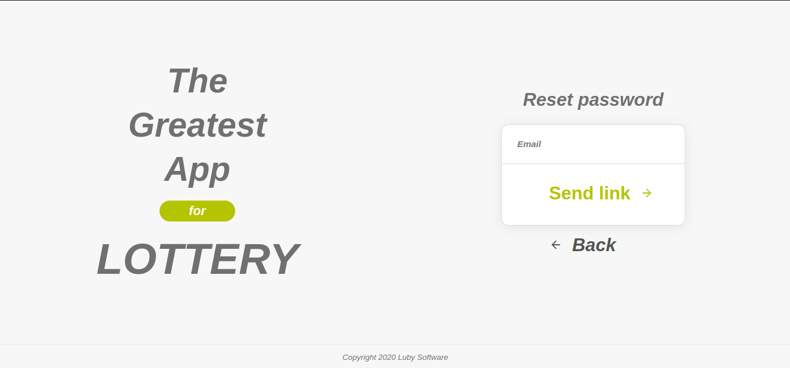
                                ChangePassword
  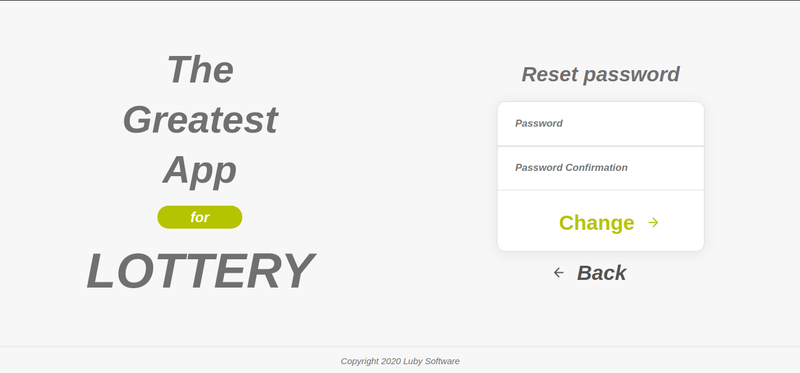
                                Dashboard
  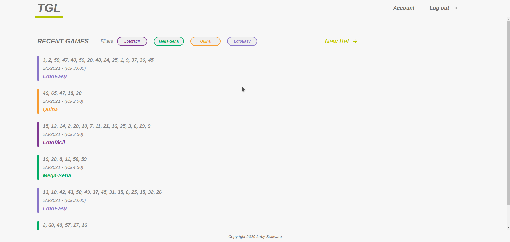
                                Account
  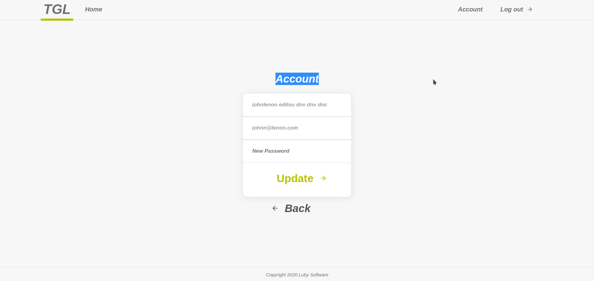
                                NewBet
  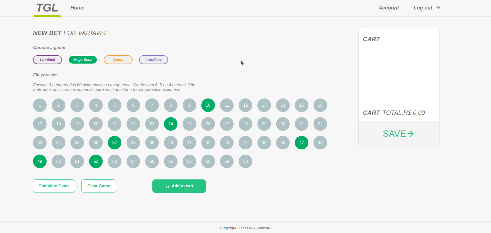
</p>
<br>


---
<br>

### Mobile
<p align="center">
                              
  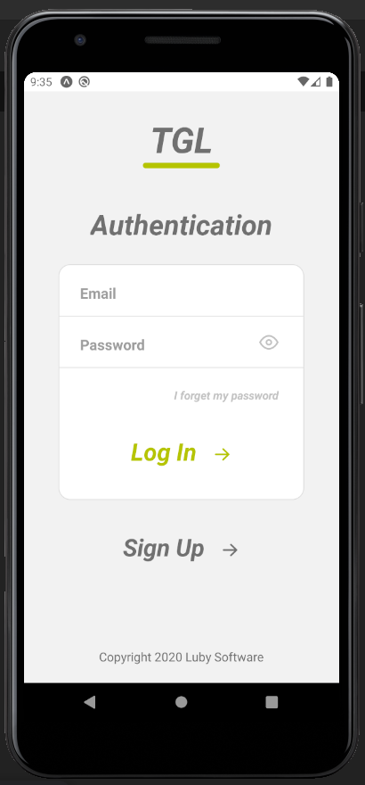
                                
  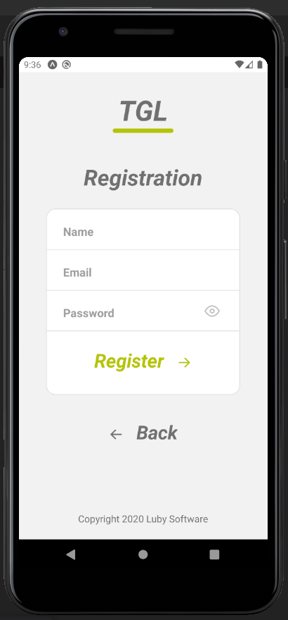
                               
  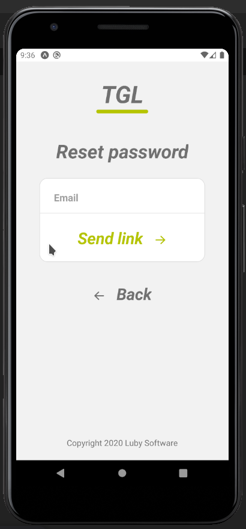
  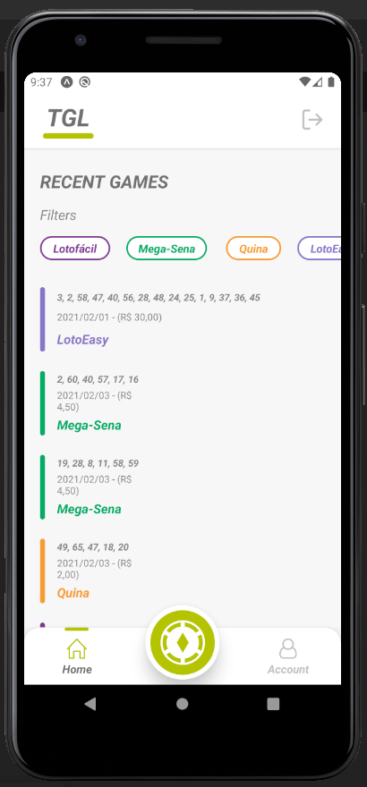
                               
  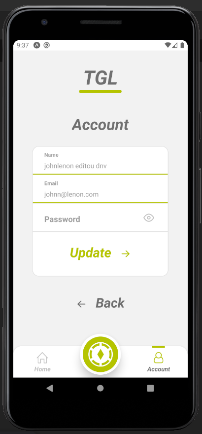
                                
  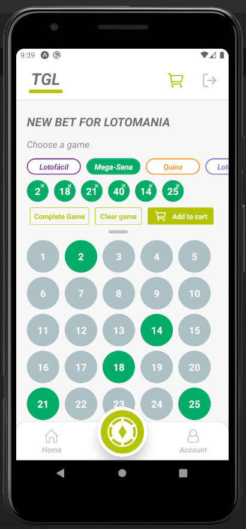
                              
  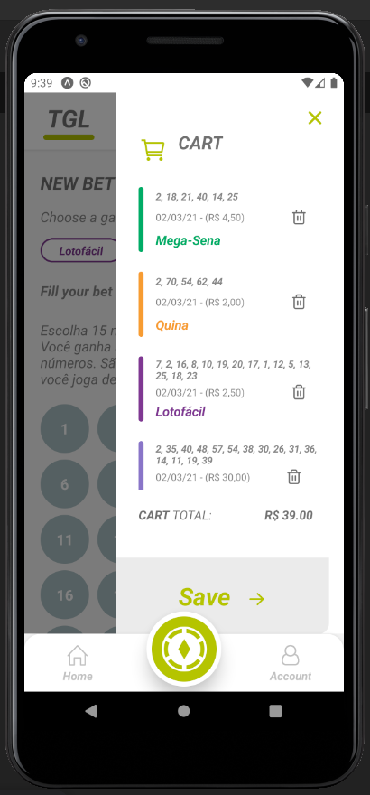

</p>
<br>
---

## 👌 Funcionalidades


* Login
* Registration
* ResetPassword
* Dashboard
* Account Settings
* New Bet
<br>
---
## 💻 Executando o TGL

### Pré-requisitos

É necessário ter instalado na sua máquina para execução desse projeto:
- NodeJS
- Gerenciador de pacotes (Npm ou Yarn) 
- Banco de dados postgreSQL(Local ou através de docker)
  - caso opte por instalar o docker este é um tutorial de instalação      
   [](https://www.notion.so/Instala-o-do-Docker-8230846ae2c547b2988f2aca91fc1edf)
  - Com o docker instalado será necessário criar um container postgreSQL através do comando 
  ```bash 

    $ docker run --name nome -e POSTGRES_PASSWORD=senha -p 5432:5432  -d postgres

    ```
    - O retorno será o id do container criado e isso indica que tudo está funcionando 
    - Agora será preciso acessar o banco de dados através de um software adequado (Beekeeper studio,DBeaver) e criar um banco de dados que sera usado no .env
  ---
  - Para rodar a aplicação mobile será necessário um emulador de android ou dispositivo físico
    - Para emulador será necessário alterar o ip em mobile/src/service/api.js para o ip público da sua maquina 
     - Para utilizar dispositivo físico será necessário instalar o aplicativo do expo em seu dispositivo e conectar via ip ou qr code 
    

### ♊ Clonando o Repositório

```bash

$ git clone https://github.com/johnldev/TGL-TheGreatestLottery

# entre na pasta do projeto

$ cd TGL-TheGreatestLottery

```
### 💻 Rodando o TGL web

Entre na pasta 

```bash

$ cd web

```
Instale as dependências

```bash

$ yarn

# ou, caso use npm

$ npm install

```

Rode a aplicação

```bash

$ yarn start

# ou, caso use npm

$ npm run start

```


### 🌐 Rodando o Servidor

Entre na pasta

```bash

$ cd api

```
Instale as dependências

```bash

$ yarn

# ou, caso use npm

$ npm install

```

- Nesse momento crie um arquivo .env na raiz do projeto e o preencha com os dados do seu banco de dados utilizando o arquivo .env-example como exemplo

Modele o banco de dados

```bash

$ adonis migration:run

# ou, caso use npm

$ adonis migration:run

```

Popule o banco de dados

```bash

$ adonis seed

# ou, caso use npm

$ adonis seed

```

Rode o servidor

```bash

$ yarn dev

# ou, caso use npm

$ npm run dev

```


### 📱 Rodando o TGL mobile 


Entre na pasta

```bash

$ cd mobile

```
Instale as dependências

```bash

$ yarn

# ou, caso use npm

$ npm install

```

Rode a aplicação

```bash

$ yarn start

# ou, caso use npm

$ npm run start

```

- Dentro do disposivo será necessário utilizar o ip disponibilizado pelo expo para a conexção com app


<br>

Se tudo deu certo, o app deve estar disponível agora! 👩‍🔧

---

## 🛠️ Tecnologias

As ferramentas usadas no desenvolvimento do projeto.

#### Backend:
- JavaScript
- NodeJS
- AdonisJS
- PostgreSQL
- LucidORM
- Yup
- JsonWebToken
- Bcriptjs

#### Web
- JavaScript
- ReactJS ⚛️
- React Router Dom
- React Icons
- Axios
- React toastify

#### Mobile:
- JavaScript
- React Native
- Expo
- Axios

---
